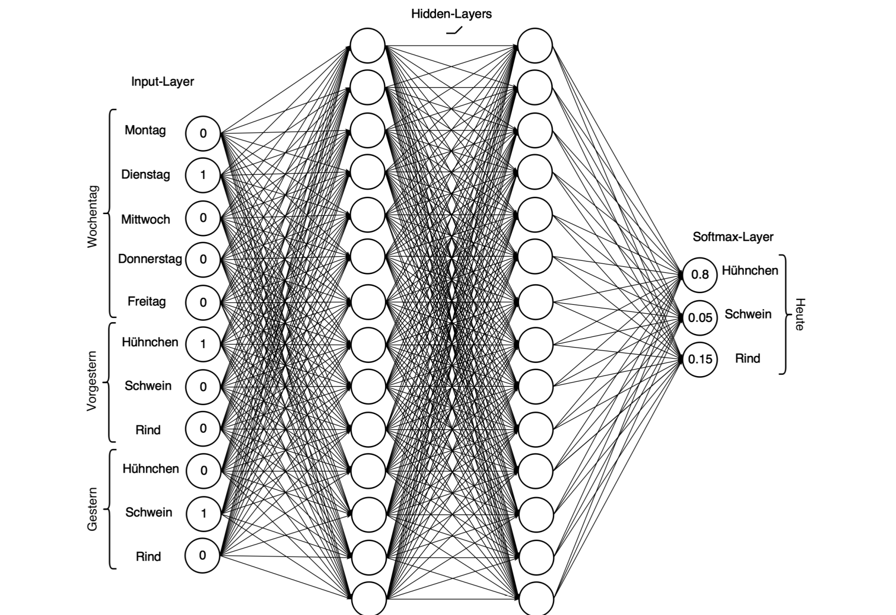
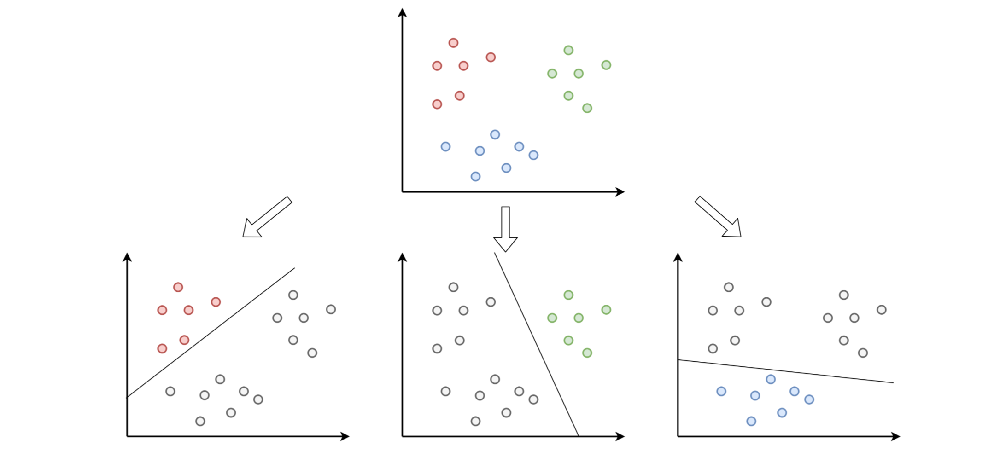

# Deep Learning in Javas Virtual Machine
This project builds a deep neural net with the popular machine learning library [DeepLearning4J](https://deeplearning4j.org/).
Its neural net tries to predict canteens menu for today based on the day of week and the previous meals.

#### Data
The training and test data set were extracted from the official [students service Leipzig](https://www.studentenwerk-leipzig.de/mensen-cafeterien/speiseplan)
web page as plain, unstructured HTML with [JSOUP](https://jsoup.org/). The model so far as simplified, that it only 
holds the meat type for a given menu. Moreover these types were reduced to the three frequently served ones: chicken (*Hähnchen*),
pork (*Schwein*) and beef (*Rind*).

#### Neural net
Although the model learns sequential data, this project uses a fully-connected multi-layer-perceptron, to map this correlation, and leaves out
recurrent neural networks. The below picture shows the network architecture based on the day of week and previous two meals as input vector. 
Thus nets input layer hold eleven neurons and has three output neurons with softmax activation, for classification purpose. Further the net
consists of two hidden layers with 14 neurons in each, where every neuron as an ReLU activation. The Java class [de.htwk.ml.deep.Network](https://github.com/erohkohl/ml-jvm/blob/master/src/main/java/de/htwk/ml/deep/Network.java)
implements this model with DeepLearning4J.

#### Train and test model
To train and test this model, simply run the JUnit test [de.htwk.ml.deep.NetworkTest](https://github.com/erohkohl/ml-jvm/blob/master/src/test/java/de/htwk/ml/deep/NetworkTest.java) in your IDE or with Maven.

#### One vs. all
For classification neural nets apply an *one vs all* vote, where all neurons in its output layer take part. Therefore 
their weights and biases form a linear separators in hyper space and compare one neurons decision against all others, like
the below picture shows. Thus the softmax function serves a probability for each class based one neurons vote.

#### Results
In all my model reaches an accuracy of over 97% on the training set after 20000 iterations and predicts three of five meals
of the test set correct.